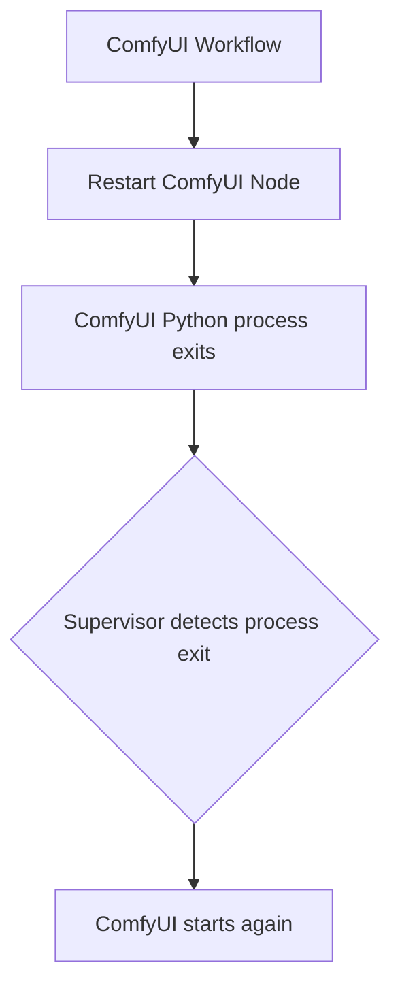
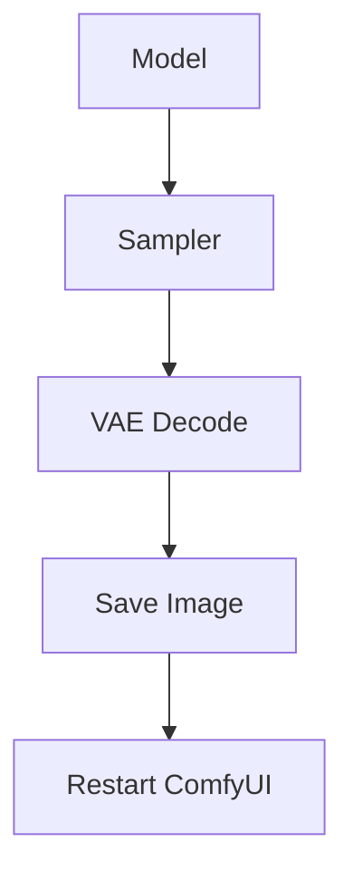
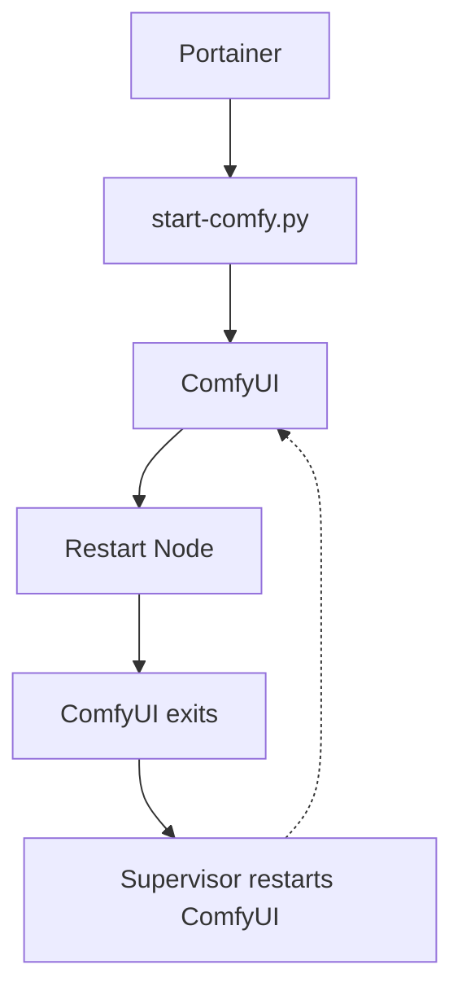
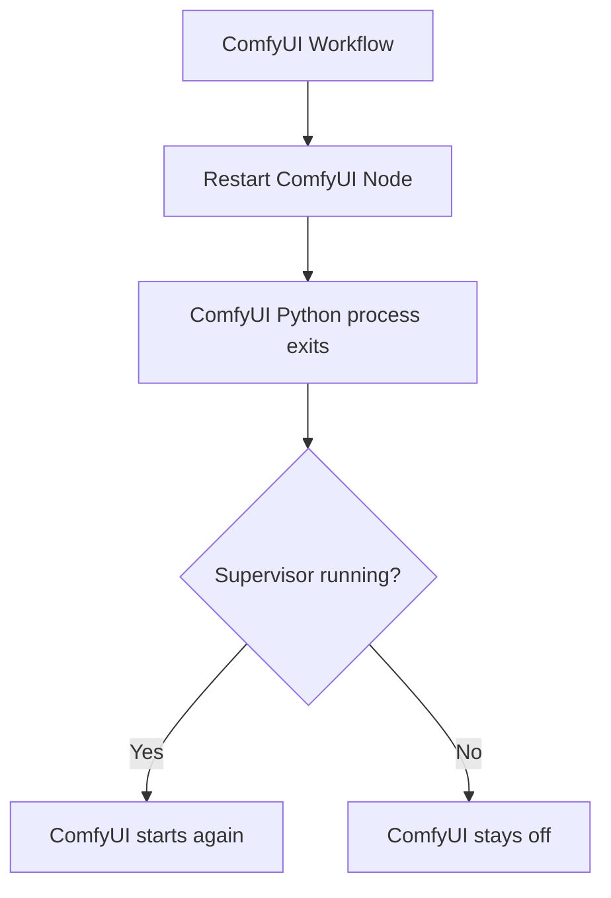

# ComfyUI Restart Node & Process Supervisor

A complete restart solution for ComfyUI installations that need
automatic recovery after workflow execution.

This project provides a safe way to automatically restart the ComfyUI
Python process after a workflow finishes, without restarting the Docker
container.

It was created to solve a specific problem observed on some systems,
especially AMD ROCm environments, where a generation can complete
successfully but the ComfyUI process may remain in an unusable state.

------------------------------------------------------------------------

# Background and motivation

In some configurations, ComfyUI can finish a workflow correctly but
leave a native runtime thread active after the generation has completed.

Typical symptoms:

-   The workflow completes successfully.
-   The generated content is created correctly.
-   The GPU becomes idle.
-   The ComfyUI interface stops responding normally.
-   CPU usage remains high even though no generation is running.
-   Restarting ComfyUI restores normal operation.

The problem is not related to a specific workflow. It can happen after
image generation, video generation, or other GPU workloads.

The solution implemented by this project is not a GPU reset or a driver
fix. Instead, it provides a controlled way to restart only the ComfyUI
Python process.

------------------------------------------------------------------------

# Project architecture

The project contains two independent components:

## 1. Restart ComfyUI Node

A ComfyUI custom node that triggers a restart request at the end of a
workflow.

## 2. ComfyUI Python Supervisor

A lightweight Python process manager that keeps running while ComfyUI is
restarted.

The complete flow:



The Docker container remains active. Only the ComfyUI process is
restarted.

------------------------------------------------------------------------

# Restart ComfyUI Node

Location:

    custom_nodes/comfyui-restart/

Files:

    __init__.py
    restart.py

The node follows the same execution concept as ComfyUI output nodes such
as:

-   PreviewImage
-   SaveImage

It is designed to be placed as the final node in a workflow.

Example:



------------------------------------------------------------------------

# Node features

-   Accepts any compatible ComfyUI object.
-   Works with:
    -   IMAGE
    -   LATENT
    -   VIDEO outputs
    -   CONDITIONING
    -   Custom node outputs
    -   Other compatible data types
-   Does not modify the received object.
-   Uses the input only as an execution trigger.
-   Configurable restart delay.
-   Designed as a final output node.

------------------------------------------------------------------------

# Installing the node

Copy the custom node folder into:

    ComfyUI/custom_nodes/

Example:

    ComfyUI/
    ├── main.py
    ├── custom_nodes/
    │   └── comfyui-restart/
    │       ├── __init__.py
    │       └── restart.py

Restart ComfyUI.

The node will appear under:

    Utils → Restart ComfyUI

------------------------------------------------------------------------

# ComfyUI Python Supervisor

File:

    start-comfy.py

The supervisor replaces traditional shell restart loops.

Instead of:

    while true
        python main.py

it provides a Python-based process manager.

------------------------------------------------------------------------

# Supervisor features

-   No fixed installation path.
-   Automatically detects the ComfyUI directory.
-   Requires only that it is located next to `main.py`.
-   Uses the currently active Python interpreter.
-   Preserves the existing environment.
-   Passes all command-line parameters to ComfyUI.
-   Automatically relaunches ComfyUI after exit.
-   Works with:
    -   Docker
    -   Portainer
    -   Conda
    -   Python virtual environments

------------------------------------------------------------------------

# Installing the supervisor

Copy:

    start-comfy.py

into the same directory as:

    main.py

Example:

    ComfyUI/
    ├── main.py
    ├── start-comfy.py
    ├── models/
    └── custom_nodes/

Run:

    python start-comfy.py --listen 0.0.0.0 --port 8188

All parameters are forwarded automatically:

    python main.py --listen 0.0.0.0 --port 8188

No ComfyUI parameters need to be duplicated.

------------------------------------------------------------------------

# Why there is no install.py

This project intentionally does not include an automatic installer.

The reason is that compatibility mode can modify the ComfyUI entry
point:

    main.py

Automatically performing this operation would be too invasive.

An automatic installer could:

-   Rename the original ComfyUI files.
-   Replace a core system file.
-   Conflict with future ComfyUI updates.
-   Break forks or custom installations.
-   Modify the user's environment without explicit approval.

For safety and transparency, installation is manual.

The user must decide whether compatibility mode is required and perform
the file changes manually.

This project provides the restart mechanism but does not silently modify
ComfyUI core files.

------------------------------------------------------------------------

# Compatibility mode for applications requiring main.py

Some applications or containers have a fixed entry point and always
execute:

    python main.py

without allowing another startup command.

For these cases, the supervisor can be used as a replacement entry
point.

## Important

Do not rename `start-comfy.py`.

The recommended method is to create a copy.

Steps:

1.  Rename the original ComfyUI entry point:

```{=html}
main.py → comfyui_main.py
```

2.  Copy the supervisor:

```{=html}
start-comfy.py → main.py
```
    

Final structure:

    ComfyUI/
    ├── main.py              <-- supervisor copy
    ├── start-comfy.py       <-- original supervisor backup
    ├── comfyui_main.py      <-- original ComfyUI entry point
    ├── models/
    └── custom_nodes/

The external application still executes:

    python main.py

but the supervisor launches:

    python comfyui_main.py

------------------------------------------------------------------------

# Updating ComfyUI when using compatibility mode

Be careful when updating ComfyUI.

Updates from:

-   ComfyUI Manager
-   git pull
-   update scripts
-   automatic installers

may restore or overwrite:

    main.py

After an update:

1.  Check that `main.py` is still the supervisor copy.
2.  If necessary, repeat:

```{=html}
main.py → comfyui_main.py
start-comfy.py → main.py
```
    
Keeping `start-comfy.py` separately provides a safe backup.

------------------------------------------------------------------------

# Docker / Portainer usage

Recommended command:

    python /path/to/start-comfy.py

Example:

    python /workspace/ComfyUI/start-comfy.py --listen 0.0.0.0

Execution flow:



------------------------------------------------------------------------

# Important notes

## Node placement

The Restart ComfyUI node should normally be the final node.

ComfyUI only executes nodes required to produce outputs. Additional
nodes after the restart node may prevent execution.

## Delay

The delay allows time for:

-   Saving images.
-   Encoding videos.
-   Completing filesystem operations.

Recommended values:

    3-10 seconds

------------------------------------------------------------------------

# Using the node without the supervisor

The Restart ComfyUI node only terminates the ComfyUI Python process.

Restarting it is the supervisor's responsibility.

When the supervisor is not running, the same node can be used as a
ComfyUI shutdown node:

-   The workflow completes.
-   The node waits the configured delay.
-   The ComfyUI Python process exits.
-   ComfyUI stays off until it is started manually.

This is useful when you want to stop ComfyUI at the end of a workflow
(for example before a server shutdown or a maintenance window) without
keeping the supervisor process alive.

The delay applies in both modes.



------------------------------------------------------------------------

# Limitations

This project restarts the ComfyUI Python process.

It does not:

-   Restart the operating system.
-   Reload GPU drivers.
-   Repair hardware failures.

A full system restart may still be required after a complete driver
failure.

------------------------------------------------------------------------

# License

MIT License
